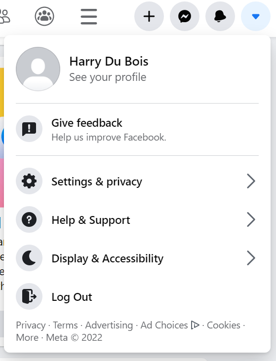
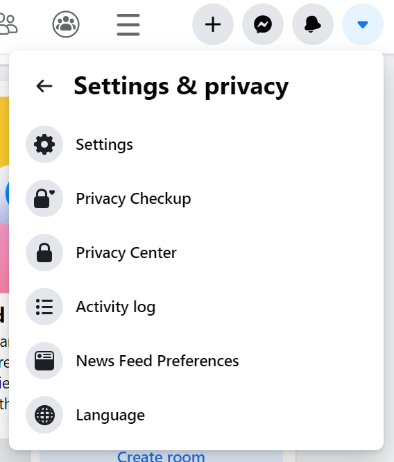
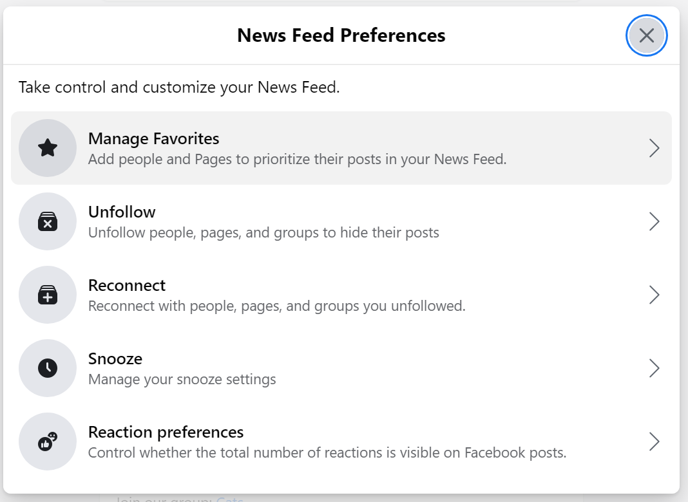
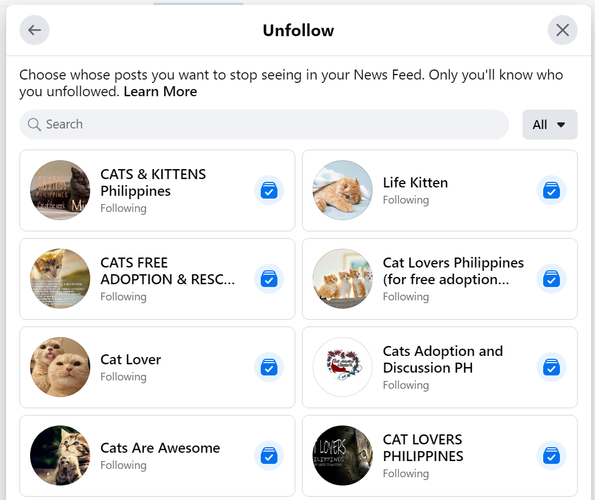
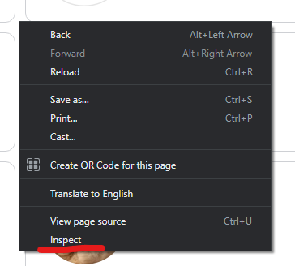
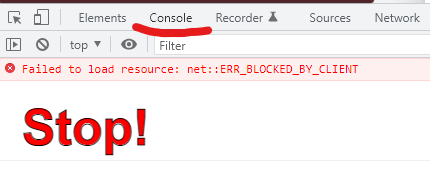
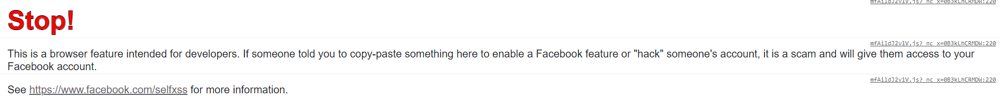

# Facebook Anti-DoomScroll
A step-by-step process of applying a script to your Facebook account to automatically unfollow EVERYTHING on your timeline.

**NOTE:** This has only been tested on Google Chrome as of May 10 2022. Please let us know if other browsers can also run this script.

1. Go to your facebook timeline at the options dropdown and select **Settings & privacy**:

2. From the **Settings & privacy** options, select **News feed preferences**.

3. You will now be in the **News feed preferences** window. Select **Unfollow**.

4. The **Unfollow** window will now show all the friends / pages / groups you follow. You will need to scroll down through everything you're following to load all that we want to automatically unfollow. 

5. With the **Unfollow** window still loaded and scrolled all the way down, right click on the **Unfollow** window and click on **Inspect**:

6. This will take you to the Google Chrome development tools. Click on the **Console** tab:

7. Note this warning. This is a warning by facebook to not use any external scripts on their web app. 

> DISCLAIMER: the script below does not tamper with any account emails/passwords. The following script only clicks the "unfollow" button on each followed account so you don't have to unfollow everything one by one.



8. Paste the following script at the Console's text area at the bottom of the window: 

```
// Get a list of elements that match selectors, i.e. "Toggle to follow" buttons. 
// Maintainers probably need to change the selector string for new FB versions

var follows = document.querySelectorAll('div[aria-label="Toggle to follow"]');

// If you want to make sure this script doesn't click on the wrong buttons, go
// to the Elements tab, press Ctrl-F, enter "Toggle to follow" in the search
// bar, then find the button that is highlighted

var delay = 1500;  // Delay between clicks to prevent being blocked by FB

var i = 0;  // Initialize a counter of unfollows

function unfollow() {
  // unfollow() calls itself recursively. If counter of unfollows reaches length
  // of friend list, stop
  if (i == follows.length) {
    return;
  }

  // Calculate remaining time based on the num. of friends not yet unfollowed
  var remaining = ((follows.length - i) * (delay+500) / 1000).toFixed(0);

  console.log(
      'Unfollowing', i + 1, 'of', follows.length + ', ~', remaining + 's',
      'remaining…');

  follows[i].click();  // Click!

  i = i + 1;  // Increment the counter of unfollows

  // Recursively call itself with a randomized delay of 500-2000ms to keep 
  // on unfollowing
  setTimeout(unfollow, Math.floor(500 + Math.random() * delay * 2));
}

// run the unfollow function
unfollow();
```


9. Wait as the script goes through one by one through the unfollow button of each account you are following. Depending on how many accounts you follow, this may take 10-30 minutes, even more. You can leave it running to do other things, and come back to it every now and then to check on its progress.

10. At some points it may try to follow again some accounts you unfollowed. You can just click on the unfollow button again.

